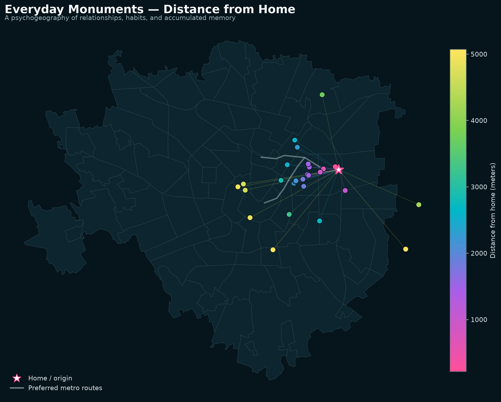
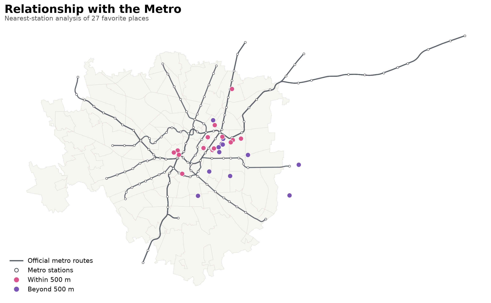

# Assignment 02 — My Affective Milan

## Objective: a psychogeography of everyday life

The objective of this project is to construct a personal psychogeography of Milan. After living in a city for a long time, one gradually stops recognizing it only through its official monuments, attractions, and guidebook destinations. The lived city takes on a different form: the true monuments of everyday life become favorite places, friends’ homes, bars, parks, places of study and work, and routes repeated over time.

These places may seem ordinary from the perspective of the institutional city, but they acquire value because experiences, relationships, and memories accumulate within them. Personal memory therefore transforms an anonymous space into a meaningful place. This map attempts to make that transformation visible by replacing Milan’s official monumental hierarchy with a geography shaped by habit and affection.

## Narrative

This dataset represents my affective geography of Milan. My home is the relational origin from which a network emerges, composed of my friends’ homes, my favorite places, and two sections of the metro system that I use or particularly appreciate. It is not a collection of attractions, but a constellation of places where I have started to build memories.

The map does not aim to describe Milan objectively or comprehensively. Instead, it presents a personal city shaped by relationships, habits, study, work, culture, music, and social life. In this representation, a bar can carry more weight than a historic monument because its value depends not on its fame, but on the experiences it contains. The places are concentrated mainly around Città Studi, Porta Venezia, and the city center, with extensions toward Ortica, Linate, the Idroscalo area, and southern Milan.

## Dataset created

The complete and reproducible Python workflow is available in the executed notebook [02-milan-psychogeography.ipynb](02-milan-psychogeography.ipynb). The notebook follows the structure of the course geoprocessing tutorials and contains the code, intermediate tables, maps, interpretation, and exported results.

The file [michelle-milano-affettiva.geojson](02-Data/michelle-milano-affettiva.geojson) contains:

- one home used as the relational origin;
- five friends’ homes;
- twenty-seven favorite places;
- two preferred metro routes.

The dataset contains Point and LineString geometries in WGS 84 (EPSG:4326). The residential locations were deliberately displaced and generalized to neighborhood scale. The original residential addresses do not appear in the public file.

## Related datasets

The primary related dataset is **ATM — Metro Stations**, published by the Municipality of Milan:

<https://dati.comune.milano.it/dataset/b7344a8f-0ef5-424b-a902-f7f06e32dd67>

It contains the name, served lines, and point geometry of every station. The complementary dataset **ATM — Metro Routes** was also used:

<https://dati.comune.milano.it/dataset/ds539_atm-percorsi-linee-metropolitane>

The background geography comes from the official **Local Identity Units (NIL) — PGT 2030** dataset:

<https://dati.comune.milano.it/dataset/e8e765fc-d882-40b8-95d8-16ff3d39eb7c>

## Research question

**How do everyday experience and the metro network transform a collection of urban spaces into a personal geography of Milan?**

The hypothesis is that many personal places are concentrated near the M1 section between Loreto and Duomo and the M2 section between Piola and Garibaldi. The metro is not merely a means of transportation: through repeated journeys, it becomes part of the city’s mental structure, connecting places, relationships, and memories. Some more peripheral places represent intentional destinations reached through other forms of mobility.

## Geoprocessing workflow

~~~mermaid
flowchart TD
    A["Personal affective Milan GeoJSON"] --> C["Check and standardize CRS — EPSG:4326"]
    B["ATM Open Data: metro stations and routes"] --> C
    C --> D["Use a metric/geodetic distance calculation"]
    D --> E["Find the nearest station for each place"]
    D --> F["Apply a 500-meter accessibility threshold"]
    E --> G["Calculate place-to-metro distance"]
    F --> H["Classify places inside or outside the threshold"]
    G --> I["Map accessibility"]
    H --> I
    I --> J["Interpret the affective geography"]
~~~

## Method performed

1. I loaded the personal dataset, the official NIL boundaries, and the official metro stations and routes.
2. I verified that the geometries were expressed in WGS 84 geographic coordinates.
3. For each favorite place, I calculated the geodetic distance to the nearest ATM station.
4. I also calculated the metric distance between the anonymized home location and every favorite place.
5. I used a threshold of 500 meters to identify places within a short walk of the metro.
6. I classified the places as either within or beyond that threshold.
7. I displayed the results over the NIL neighborhood boundaries and the official metro routes.

## Maps produced

### 1. Everyday monuments

The first map replaces the city’s tourist hierarchy with a personal one. My home, represented through an anonymized location, serves as the origin of the network. A continuous pink–purple–turquoise–green–yellow palette expresses distance from home, ranging from approximately 215 to 5,070 meters. The connecting lines do not necessarily indicate actual journeys; they express the mental relationship between this origin and the places where memories have formed.

### 2. Relationship with the metro

The second map displays the official metro network and classifies favorite places according to their distance from the nearest station:

- **15 of the 27 places** are within 500 meters of a station;
- **12 of the 27 places** are more than 500 meters away;
- the median distance to the metro is approximately **443 meters**;
- the observed distances range from approximately **129 meters** to **2,073 meters**.

The Python notebook also exports [an analyzed GeoJSON](02-Data/michelle-milano-affettiva-analyzed.geojson) containing the nearest station, served metro lines, distance in meters, and the 500-meter classification for each favorite place.

## Interpretation

The distribution reveals the central role of the Città Studi–Porta Venezia–city center axis in my experience of Milan. More than half of my favorite places are located within a short walk of the metro. This supports the idea that the transport network is not merely the background to movement but contributes to the formation of personal geography: the ease with which a place can be reached encourages repeated visits and, through repetition, the construction of memory.

Places located more than 500 meters from a station are not less important. Instead, they can be understood as intentional destinations: places visited because they possess a particular value, rather than simply because they are easy to reach. The resulting psychogeography is therefore composed of two complementary relationships—the familiarity produced by proximity and repetition, and the affection that justifies a longer journey.

The final map can be read as a spatial self-portrait. It does not show what Milan considers important, but what has become important through my way of inhabiting the city. The most meaningful points operate as personal monuments, while the metro lines form the connective structure that allows them to be crossed and related to one another.

## Notes and limitations

- Residential locations were deliberately approximated to protect privacy.
- The personal M1 and M2 routes are schematic; the analytical map compares them with official ATM geometries.
- “La Belle Aurore” appeared twice in the original list and was included only once.
- The location of Pizzeria Santa Maria must be confirmed before final submission.
- Public-place coordinates were obtained from public cartographic sources and checked spatially; less recognizable places still require personal verification.
