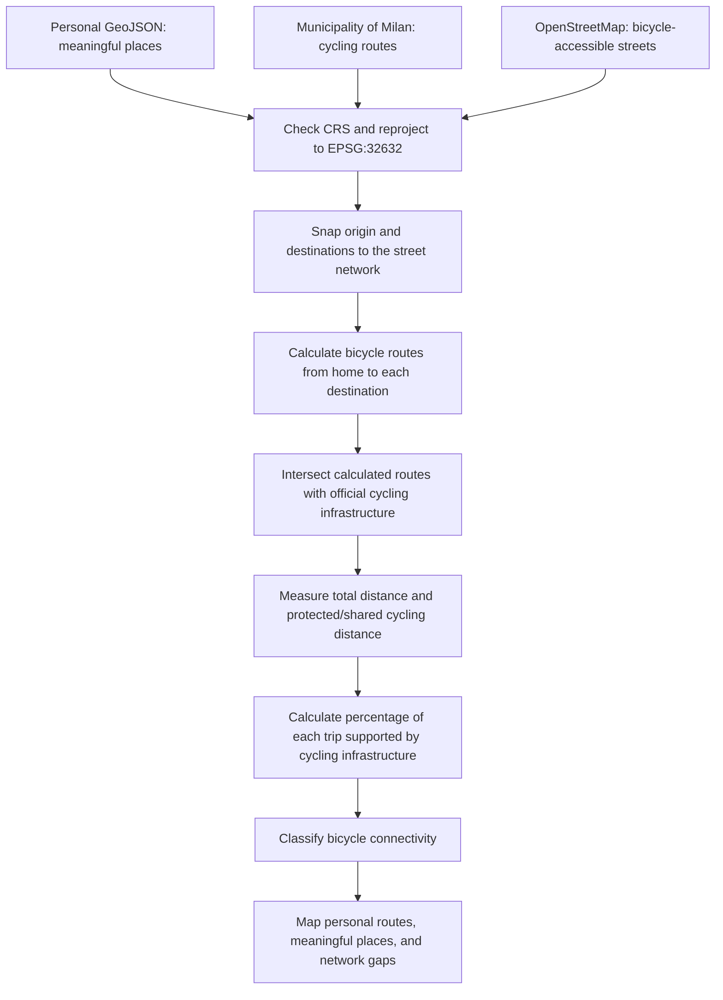

# Assignment 02 — Geoprocessing

## My Affective Milan: Everyday Places by Bicycle

### Project objective

This project proposes a personal psychogeography of Milan based on the places that have acquired meaning through everyday life. After living in a city for a long time, its official monuments are no longer the only points that define it. Bars, parks, friends’ homes, places of study and work, and other familiar destinations become personal monuments because they contain relationships, routines, and accumulated memories.

I move through Milan mainly by bicycle. For this reason, the city is not only a collection of meaningful points: it is also a system of streets and cycling routes that connects them. The project asks how bicycle mobility shapes my mental image of Milan and how well my personal geography is supported by the existing cycling network.

## Personal dataset

The file [my-affective-milan.geojson](my-affective-milan.geojson) contains a dataset created specifically for this assignment. It includes:

- one generalized home location, used as the relational origin;
- five generalized locations representing friends’ homes;
- twenty-seven favorite places connected to culture, music, social life, study, work, parks, and everyday routines.

All features are points in WGS 84 geographic coordinates (`EPSG:4326`). Residential locations have been deliberately moved and generalized to neighborhood scale. No residential addresses or personal names appear in the submitted dataset.

### Attribute structure

Each feature includes:

- `name`: the name or anonymized label of the place;
- `category`: `home_origin`, `friends_home`, or `favorite_place`;
- `subcategory`: the type of activity or memory associated with the place;
- `privacy`: included when a residential location has been generalized;
- `geometry`: the point coordinates.

## Proposed related datasets

### Primary dataset: Milan cycling routes

The primary related dataset is **Itinerari ciclabili**, published by the Municipality of Milan:

<https://dati.comune.milano.it/dataset/ds60_infogeo_piste_ciclabili_localizzazione_>

Downloadable GeoJSON:

<https://dati.comune.milano.it/dataset/ceda0264-24f3-4869-9a2d-411906f0abab/resource/56515ac3-e260-4ebb-bfce-698347f07e1e/download/bike_ciclabili.geojson>

This line dataset represents existing cycling itineraries within Milan. It includes cycle lanes, separated cycle tracks, shared pedestrian paths, mixed-traffic routes, greenways, and traffic-calmed streets. Its attributes describe infrastructure type, direction of travel, network class, street name, regulation, and segment length.

### Supplementary dataset: OpenStreetMap street network

The full network of bicycle-accessible streets can be obtained from [OpenStreetMap](https://www.openstreetmap.org/) through a tool such as [OSMnx](https://osmnx.readthedocs.io/). This dataset would make it possible to calculate connected bicycle routes even where the official cycling-infrastructure dataset is discontinuous.

## Research question

**How does Milan’s street and cycling network connect the places that form my personal geography of the city?**

The analysis would test whether my everyday destinations are located near dedicated or traffic-calmed cycling infrastructure and identify the sections of the city where reaching a meaningful place requires cycling on ordinary streets.

## Proposed geoprocessing methodology

1. Load the personal GeoJSON and the official cycling-route GeoJSON.
2. Obtain the bicycle-accessible Milan street network from OpenStreetMap.
3. Check the coordinate reference systems of all layers.
4. Reproject the datasets to `EPSG:32632`, a projected CRS with meter units suitable for Milan.
5. Snap the generalized home origin and each destination to the nearest bicycle-accessible street segment.
6. Calculate a shortest bicycle route from the home origin to every favorite place and friends’ home.
7. Intersect each calculated route with the official cycling-infrastructure dataset.
8. Calculate for every destination:
   - total cycling distance;
   - distance traveled on official cycling infrastructure;
   - percentage of the journey supported by cycling infrastructure;
   - distance from the destination to the nearest cycling segment.
9. Classify destinations according to their level of bicycle connectivity.
10. Produce a map showing the routes, destinations, and gaps in the cycling network.

## Proposed workflow diagram

## Expected outcome

The expected result is not simply a map of favorite places. It is a relational map in which streets become the connective tissue of memory. The bicycle routes would reveal how separate points are joined through repeated movement and how mobility participates in the construction of a personal city.

Destinations with a high percentage of dedicated or traffic-calmed cycling infrastructure could be interpreted as strongly integrated into my everyday bicycle geography. Destinations that require long sections on ordinary roads would expose gaps between my lived geography and Milan’s formal cycling network.

## Proposed visual language

The personal locations would be displayed as points over a subdued street network. Calculated bicycle routes would connect the generalized home origin to each destination. A continuous color palette containing pink would represent either cycling distance or the percentage of each route supported by cycling infrastructure. Official cycling routes would appear as a separate line layer so that overlaps and missing connections remain visible.

